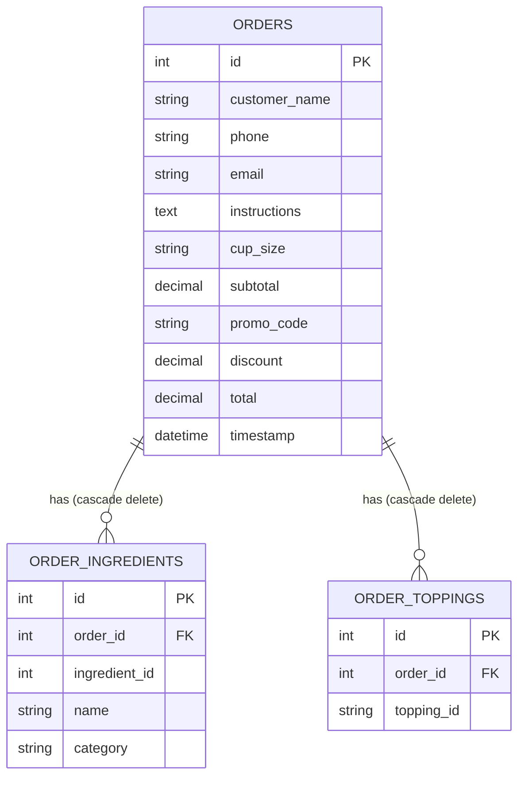

# ☕ Cozy Cup - Custom Coffee Shop

> **"A Moment, Brewed."** Experience the art of luxury coffee. Freshly brewed for you, crafted with passion.

Cozy Cup is an elegant, premium, full-stack web application designed for a luxury coffee experience. It features an interactive, real-time **Custom Coffee Builder**, a multi-step checkout flow, and a high-performance **FastAPI** backend backed by a **MySQL** database.

---

## 🌟 Key Features

### 1. Interactive Coffee Customizer (`/make-coffee`)
* **Real-time Cup Visualizer:** Watch the virtual cup fill up dynamically with styled, colored layers as you add ingredients.
* **Handcrafted Ingredients Selection:** Choose from multiple categories including Bases (Espresso, Cold Brew, Drip Coffee), Milk (Oat Milk, Almond Milk, etc.), Syrups (Vanilla, Caramel), Sweeteners, Spices, and Toppings.
* **Intelligent Validation:** Prevents brewing without selecting at least one coffee base.
* **Pagination & Search:** Easily browse and filter ingredients with interactive search queries and category filters.
* **Responsive Floating Cup:** Accessible sidebar on desktop and a clean sliding drawer modal on mobile.

### 2. Multi-Step Checkout Flow (`/order`)
* **Step 1: Your Details:** Collects name, validated phone number, optional email (for receipt), and custom special instructions.
* **Step 2: Choose Your Cup:** Select sizes (Small, Medium, Large, Extra Large) with dynamic price calculation, and add finishing toppings (Whipped Cream, Cocoa Nibs, Caramel Drizzle).
* **Step 3: Checkout & Payment:** Features promo code integration. Enter the promo code **`Coffee`** to apply a 100% discount for verification purposes.
* **Receipt & Order Success Screen:** Interactive success page displaying the summary, custom ingredient colors, and receipt details.

### 3. High-Quality Premium Aesthetics
* Curated dark-themed design system matching rich coffee elements (Gold `#C08B5C`, Cream `#F5E6D3`, Dark Brown `#120A08`).
* Smooth micro-animations, background floating particles, and realistic animated steam wisps rising from the cup using **Framer Motion**.
* Responsive layouts optimized for all viewport sizes.

---

## 🛠️ Technology Stack

### Frontend
* **Core:** [React 19](https://react.dev/) + [Vite 7](https://vite.dev/)
* **Styling:** [Tailwind CSS v4](https://tailwindcss.com/) (using the `@tailwindcss/vite` plugin for lightning-fast builds)
* **Animations:** [Framer Motion 12](https://www.framer.com/motion/)
* **Routing:** [React Router DOM v7](https://reactrouter.com/)
* **Icons:** [React Icons](https://react-icons.github.io/react-icons/)

### Backend
* **Framework:** [FastAPI](https://fastapi.tiangolo.com/) (Python)
* **ORM:** [SQLAlchemy](https://www.sqlalchemy.org/)
* **Database Driver:** `pymysql` (with MySQL support)
* **Validation:** [Pydantic v2](https://docs.pydantic.dev/)
* **ASGI Server:** [Uvicorn](https://www.uvicorn.org/)

### Database
* **Relational DBMS:** [MySQL](https://www.mysql.com/)

---

## 📂 Project Structure

```text
Coffee-Shop/
├── Backend/
│   ├── App.py            # FastAPI main application server & endpoint definitions
│   ├── database.py       # SQLAlchemy engine & MySQL database connection pool
│   └── models.py         # DB models (Order, OrderIngredient, OrderTopping)
├── src/
│   ├── assets/           # Static images & graphics (e.g., Coffee-cup.png)
│   ├── components/       # Reusable React components (Navbar, Coffee Builder, etc.)
│   │   ├── MakeCoffee.jsx    # Custom coffee creator & cup visualizer
│   │   ├── OrderPage.jsx     # Checkout steps, validation, and API poster
│   │   └── CursorGlow.jsx    # Smooth custom glow pointer effect
│   ├── pages/            # Page layouts
│   │   └── Home.jsx          # Combines landing page sections
│   ├── sections/         # Home page sections (Hero, About, Menu, Gallery, etc.)
│   │   ├── HeroSection.jsx   # Premium landing section with steam animation
│   │   └── ...
│   ├── index.css         # Tailwind v4 theme configurations
│   ├── App.jsx           # Client router setup
│   └── main.jsx          # React app entrypoint
├── index.html
├── package.json          # Node dependencies and build scripts
└── vite.config.js        # Vite compiler configurations
```

---

## 🗄️ Database Design

The schema is automatically generated by SQLAlchemy when the FastAPI server boots up. The schema features three key tables:



* **`orders`:** Stores customer details, selected cup size, transaction summaries, and creation timestamps.
* **`order_ingredients`:** Relational lookup matching custom coffee ingredients selected by the customer.
* **`order_toppings`:** Relational lookup matching extra toppings added in the checkout process.

---

## ⚡ Setup & Run Instructions

### Prerequisites
* **Node.js** (v18 or higher recommended)
* **Python 3.8+**
* **MySQL Server** running locally or remotely

---

### Step 1: Database Setup
1. Open your MySQL client and create a new database called `coffee_shop`:
   ```sql
   CREATE DATABASE coffee_shop;
   ```
2. Open [Backend/database.py](file:///c:/Users/karth/Desktop/Coffee-Shop/Coffee-Shop/Backend/database.py) and update the `DATABASE_URL` with your MySQL username, password, and port:
   ```python
   DATABASE_URL = "mysql+pymysql://<user>:<password>@localhost:3306/coffee_shop"
   ```
   *(Note: Special characters in passwords, like `@`, must be URL-encoded, e.g., `@` becomes `%40`)*.

---

### Step 2: Backend Setup (FastAPI)
1. Navigate to the `Backend` directory:
   ```bash
   cd Backend
   ```
2. Create and activate a Python virtual environment:
   ```bash
   python -m venv .venv
   # Windows:
   .venv\Scripts\activate
   # macOS/Linux:
   source .venv/bin/activate
   ```
3. Install the required Python packages:
   ```bash
   pip install fastapi uvicorn sqlalchemy pymysql pydantic cryptography
   ```
4. Start the FastAPI server using Uvicorn:
   ```bash
   uvicorn App:app --reload --port 8000
   ```
   The backend API will run at `http://localhost:8000`. The tables will automatically generate inside your MySQL database.

---

### Step 3: Frontend Setup (Vite + React)
1. Open a new terminal window at the project root `Coffee-Shop/`.
2. Install the node packages:
   ```bash
   npm install
   ```
3. Start the local frontend development server:
   ```bash
   npm run dev
   ```
4. Open the link provided in the terminal (usually `http://localhost:5173`) in your browser.

---

## 🔌 API Endpoints

### `POST /api/orders`
Submits a new handcrafted coffee order to the database.

* **Payload Example (`OrderRequest`):**
```json
{
  "customer": {
    "name": "Karthikeyan VR",
    "phone": "9876543210",
    "email": "karthikeyan33607@gmail.com",
    "instructions": "Extra hot, no foam"
  },
  "order": {
    "ingredients": [
      { "id": 1, "name": "Espresso", "category": "Base" },
      { "id": 6, "name": "Oat Milk", "category": "Milk" },
      { "id": 13, "name": "Caramel Syrup", "category": "Syrup" }
    ],
    "cupSize": "medium",
    "extraToppings": ["whipped-cream", "caramel-drizzle"],
    "subtotal": 6.00,
    "promoCode": "Coffee",
    "discount": 6.00,
    "total": 0.00
  },
  "timestamp": "2026-06-26T11:00:00.000Z"
}
```

* **Success Response:**
```json
{
  "success": true,
  "message": "Order received and saved",
  "order_id": 1
}
```

---

### `GET /api/orders`
Retrieves a chronological list of placed orders, showing the latest orders first.

* **Response Example:**
```json
[
  {
    "id": 1,
    "customer": "Jane Doe",
    "phone": "9876543210",
    "cup_size": "medium",
    "total": 0.00,
    "ingredients": ["Espresso", "Oat Milk", "Caramel Syrup"],
    "toppings": ["whipped-cream", "caramel-drizzle"],
    "timestamp": "2026-06-26T11:00:00"
  }
]
```

---

## 📜 License & Attributions
* Feel Free to Use it
